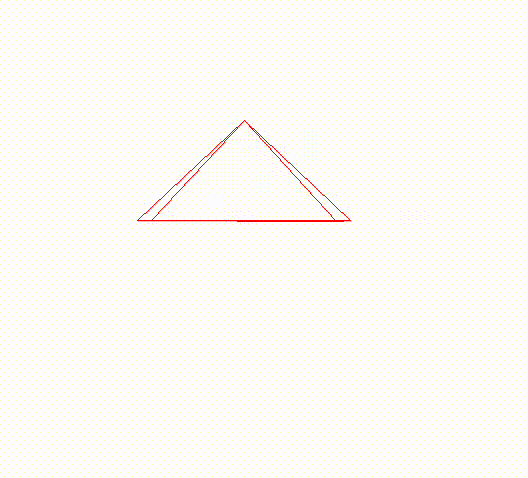

## 3d-sdl
3D graphics implementation using libSDL2

## Building
This project uses `micromamba` to manage dependencies, once those are installed, use `make` to run.

Gif showing rotation based on cursor movements.

